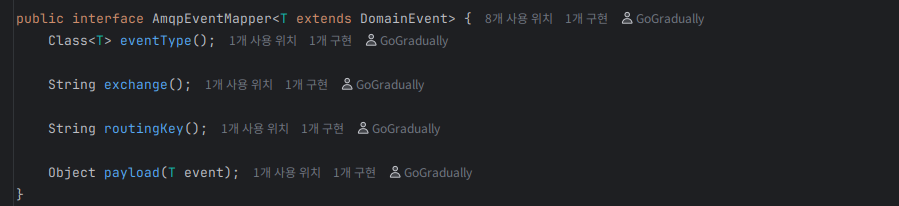
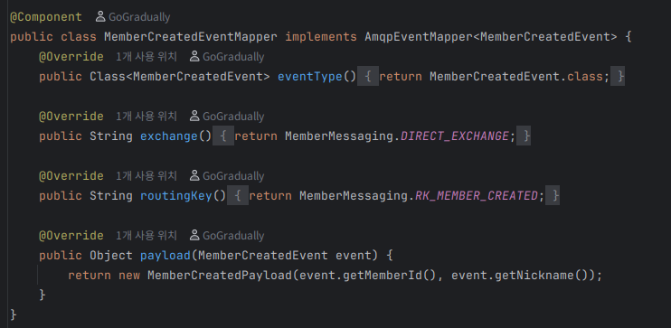
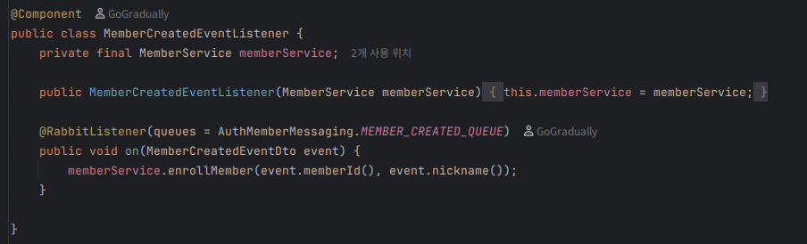

## AsyncAPI - EDA를 향한 이벤트 교환 계약 문서 작성

추천 이전
글: [Rabbit MQ의 이름 짓기](https://dev.go-gradually.me/entry/RabbitMQ-Rabbit-MQ%EC%9D%98-%EC%9D%B4%EB%A6%84-%EC%A7%93%EA%B8%B0)

Rabbit MQ를 이용한 이벤트 송/수신 방식을 설계하려면, 이 또한 계약을 설계해야 한다.

> 프로토콜, API, 메시지 포맷 등을 설계하는 것은 백엔드 개발자의 매우 중요한 역할 중 하나이다.

MSA 에서 이벤트 기반 메시징을 설계할 때, 다음과 같은 사항들을 고려해야 한다.

- 프로듀서 주체
    - Exchange name
    - Routing key
- 컨슈머 주체
    - Queue name
    - binding key

이를 바탕으로, 다음과 같이 계약을 "알아야 하는 것 기준"으로 분류할 수 있다.

- 생산자만 알면 되는 것
    - 없다. 컨슈머가 해당 이벤트 계약을 사용하려면 exchange, routing key 모두 알아야 한다.
- 소비자만 알면 되는 것
    - Queue 이름
    - binding key(라우팅 키의 조합)
- 생산자와 소비자 모두가 알아야 하는 것
    - Exchange name(프로듀서가 결정하고, 컨슈머가 이를 반영하여 바인딩한다.)
    - 메시지 포맷 (JSON 스키마 등)
    - 이벤트 명명 규칙 (예: user.created, order.placed 등)
    - 라우팅 키 (예: 도메인.행동 등)

### 계약 정의 방식

1. AsyncAPI 도입

- 비교적 정석적인 방법
- AsyncAPI 스펙을 이용하여, 이벤트 기반 메시징 계약을 정의
- 이를 asyncapi.yaml 등의 파일로 작성
- node의 asyncapi-generator 등을 이용하여, html 문서화 및 코드 생성 가능
- 장점: 명확한 계약 정의, 다양한 언어 및 플랫폼 지원
- 단점: 추가 학습 필요, 구현 복잡성 증가

2. POJO 클래스 그대로 사용

- 이는 따로 계약용 모듈을 만들어, 프로듀서와 컨슈머가 이를 의존하도록 한다.
- 타입스크립트의 경우, 프론트와 백이 동일한 DTO를 그대로 사용하는 것에 차용하여 생각해 낸 아이디어였다.
- 장점: 구현이 간단하고, 자바 개발자에게 익숙함
    - 타입스크립트 + NestJS + React 조합에서 DTO 공유하는 방식이 부러웠다(...)
- 단점: 메시지 포맷 변경 시, 양쪽 모두 재배포 필요
    - 이는 MSA의 장점인 독립적 배포와 상충될 수 있다.

고민해본 결과, 이왕 MSA를 도입해본 김에, 좀 더 형식적으로 AsyncAPI 방식을 도입해보기로 했다.

> MSA가 정말 함부로 쓰는 기술이 아니구나,
> 도입하는 순간 고정적인 구현 복잡도가 바닥에 깔리는 느낌을 받았다.

### AsyncAPI 문서 작성하기

문서 작성 사이트(IDE 역할): https://studio.asyncapi.com/

튜토리얼: https://www.asyncapi.com/docs/tutorials/getting-started

API 문서: https://auth.pinit.go-gradually.me/async-api/index.html

---

### 참고: Exchange 타입의 결정 기준 (GPT 응답)

---

## 1. Direct Exchange – “정확히 이 큐로 보내고 싶을 때”

**사용 시점**

* 라우팅 규칙이 단순하고, **명확한 채널 분리**가 필요할 때
* 서비스/기능별로 큐를 딱 나누고 싶은 경우

**대표 사용 예**

1. **로그 레벨별 분리**

* `routingKey = info` → `log.info.queue`
* `routingKey = error` → `log.error.queue`

2. **도메인별 작업 큐**

* `order.created` → 주문 처리 큐
* `payment.completed` → 결제 처리 큐

3. **멀티 인스턴스의 단일 소비 그룹**

* 하나의 Queue에 여러 Consumer 인스턴스를 붙여서 **작업 분산(Work Queue)** 패턴 구현

**요약**

* “이 키면 이 큐” 같은 **단일 조건 라우팅**이 필요할 때 사용.

---

## 2. Fanout Exchange – “그냥 모두에게 뿌릴 때”

**사용 시점**

* 동일한 이벤트를 **여러 시스템이 동시에** 알아야 할 때
* 라우팅 조건이 필요 없고, **브로드캐스트**만 하면 될 때

**대표 사용 예**

1. **이벤트 브로드캐스트**

* 사용자 가입 이벤트 발생:

    * 마케팅 시스템, 알림 시스템, 통계 시스템 등이 모두 동일 이벤트 수신

2. **캐시 무효화 이벤트**

* 특정 데이터 변경 시:

    * 여러 서비스 인스턴스의 로컬 캐시를 한 번에 무효화

3. **로깅/모니터링**

* 비즈니스 서비스 + 별도의 로그 수집/분석 시스템이 같은 메시지를 받아야 할 때

**요약**

* “누가 받을지는 신경 안 쓰고, 바인딩된 애들은 다 받아라” 구조일 때 사용.

---

## 3. Topic Exchange – “유연한 필터링/구독이 필요할 때”

**사용 시점**

* 라우팅 키에 **여러 차원의 의미(도메인, 레벨, 지역 등)** 를 담고, 이를 기준으로 **다양한 구독 패턴**을 만들고 싶을 때
* Pub/Sub에서 구독자마다 **필터 조건**이 다른 경우

**대표 사용 예**

1. **로그 시스템**

* Routing key: `log.{level}.{service}`

    * 예: `log.info.order-service`, `log.error.payment-service`
* Queue 바인딩:

    * `log.error.*` → 에러만 모으는 큐
    * `log.#` → 모든 로그 모니터링 큐

2. **지역/서비스별 이벤트 분리**

* Routing key: `order.created.kr`, `order.created.us`
* Queue 바인딩:

    * `order.created.kr` → 한국 전용 처리
    * `order.created.*` → 모든 국가 주문 처리

3. **멀티 테넌트 + 기능 단위 구독**

* `tenantA.order.created`, `tenantB.order.canceled` 등
* 특정 테넌트/이벤트 조합만 구독하는 큐를 구성 가능

**요약**

* 라우팅 키 설계를 통해 **패턴 기반으로 다양한 뷰/구독을 만들고 싶을 때** 사용.

---

## 4. Headers Exchange – “메시지 메타데이터 조건으로 라우팅할 때”

**사용 시점**

* 라우팅 키로 표현하기 어려운, **복수 조건 기반 라우팅**이 필요할 때
* 이미 header에 많은 메타데이터가 있고, 이걸 그대로 라우팅에 쓰고 싶을 때
* 메시지 포맷(바디)은 그대로 두고, **헤더 기준 정책**으로 분기할 때

**대표 사용 예**

1. **복합 조건 라우팅**

* header: `type=payment`, `region=KR`, `priority=high`
* Queue A: `type=payment AND region=KR`
* Queue B: `priority=high`

2. **버전/포맷별 처리**

* header: `schemaVersion=1`, `schemaVersion=2`
* 각 버전마다 다른 Consumer로 보내고 싶은 경우

3. **규정/정책 기반 분류**

* header에 `compliance=true`, `internal=true` 등이 있을 때,
* 내부 감사용 큐, 규정 준수용 큐로 추가 복사

**요약**

* “라우팅 키로는 깔끔하게 안 나오는 복잡한 조건”이 있을 때,
  header와 `x-match(any/all)`를 이용해서 라우팅할 때 사용.

---

### 코드 작성

이제 본격적으로 설계한 API 대로 메시지 브로커를 설정해보자.

- 바인딩 키와 큐 이름은 컨슈머의 책임이다.
- API 문서에 작성된 exchange 이름과 Routing Key 이름을 바탕으로, 큐 이름과 바인딩을 지정한다.
- 하나의 “작업 타입”에 대해서는, 하나의 소비자 그룹(= 하나의 논리적 마이크로서비스) 만이 그 작업을 처리하도록 설계해야 한다.
- 메시징 시스템은 보통 중복 전달될 수 있으므로(at-least-once), 소비자는 멱등하게 설계해야 한다. (작업 ID 기준으로 중복 방지 등)

---

#### 프로듀서 측 코드

**Exchange & Routing Key 이름 정의**

**RabbitMQ Config**

- 해당 코드에서 프로듀서가 정의해야 할 Exchange를 설정한다.
- 여기서 MessageConverter를 JSON으로 설정하여, 메시지 바디를 JSON 형식으로 직렬화/역직렬화하도록 한다.
    - 메시지 컨버터는 org.springframework.amqp.support.converter.MessageConverter이다.
    - 기본적으로 RabbitMQ는 바이트 배열을 메시지 바디로 사용하므로, JSON 직렬화/역직렬화를 위해서는 MessageConverter 설정이 필요하다.

**RabbitMQ Domain Event Publisher**

- RabbitTemplate을 이용하여, 메시지를 발행한다.
- AmqpEventMapper 인터페이스를 통해, 도메인 이벤트를 메시지 포맷으로 매핑한다.
    - 여기서 LSP를 위해, AmqpEventMapper<DomainEvent>로 타입을 상위타입으로 제한한다.
    - 이때 강제 형 변환은 @SuppressWarnings("unchecked")로 감수했다.

**AmqpMapper 및 MemberCreatedEventMapper**

Payload 클래스는 단순 레코드를 사용했다.

--

#### 컨슈머 측 코드

**RabbitMQ Config**

- 컨슈머 또한 메시지 컨버터를 JSON으로 설정한다.

**Exchange 및 바인딩 키, 큐 이름 정의**

**AuthRabbitMQConfig**

- 여기서 프로듀서에서 정의한 Exchange 이름과 Routing Key를 바탕으로, 큐와 바인딩을 설정한다.

**MemberCreatedEventListener**

---

이렇게 프로듀서와 컨슈머 측 코드를 작성하면, RabbitMQ를 통한 이벤트 교환이 가능하다.

아직 트랜잭션 아웃박스 패턴은 적용하지 않았다. 이는 다음 글에서 다룰 예정이다.